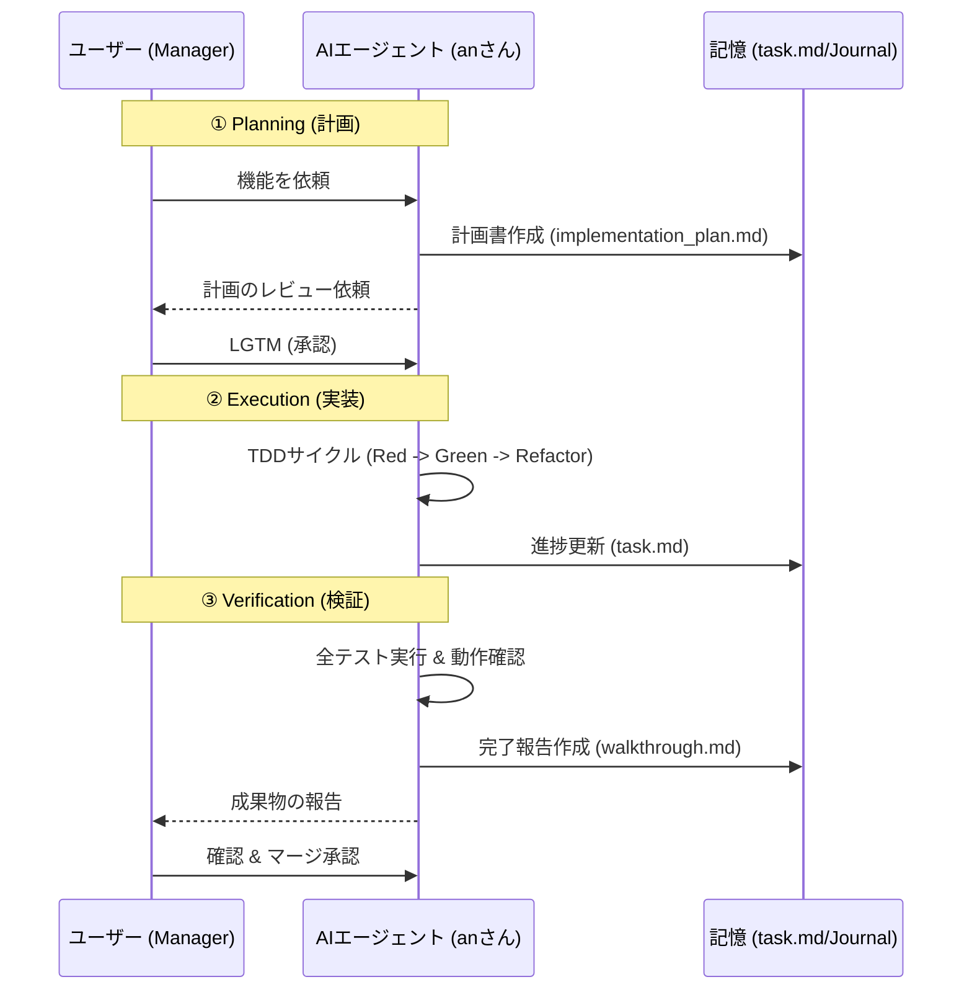

# AIエージェント開発ガイド

本プロジェクトでは、AIエージェントと人間が効率的かつ安全に協働するための独自のワークフローを採用しています。このドキュメントでは、AIエージェント（Antigravity）を活用した開発の流れを説明します。

## 1. 開発の基本サイクル (Phased Approach)

開発は必ず以下のフェーズを経て進行します。各フェーズの成果物は、後続のミスを防ぐための「記憶」として機能します。

### 各フェーズの詳細
- **AIの動き**: `task.md`（タスク一覧）と `implementation_plan.md`（実装計画書）を作成・更新します。
- **人間の役割**: 計画に無理がないか、設計に違和感がないかを確認し、承認（LGTM）を出します。
- **重要**: 計画なしにコードを書き始めることは「Cowboy Coding」として禁止されています。

### ② Execution (実装 - TDD)
- **AIの動き**: テスト駆動開発（TDD）に則り、以下の順で進めます。
  1. **RED**: 失敗するテストコードを書く。
  2. **GREEN**: テストを通すための最小限の実装を行う。
  3. **REFACTOR**: コードを綺麗に整える。
- **人間の役割**: AIが吐き出すコードの意図を把握し、必要に応じて軌道修正を指示します。

### ③ Verification (検証)
- **AIの動き**: テストを実行し、`walkthrough.md`（完了報告書）を作成します。
- **人間の役割**: 最終的な動作確認を行い、マージを承認します。

## 2. 【ユーザー視点】AIエージェントとの協働ユースケース

あなたがマネージャーとして、AIエージェント（Antigravity）をどのように使い分け、指示を出すべきかをユースケース別にまとめます。

### ユースケースA：新しい機能の実装（実案件）
*例：カロリー管理APIに「食事記録の追加」機能を作りたい*

1.  **指示**: 「〇〇という機能を作りたい。`docs/ARCHITECTURE.md`の設計に従って、TDDで進めて」と依頼します。
2.  **計画承認**: エージェントが作成した `implementation_plan.md` を確認します。設計ミスがないかチェックし、良ければ「LGTM（承認）」を出します。
3.  **実装監視**: エージェントがテストを書き、実装を完了するのを待ちます。
4.  **報告確認**: `walkthrough.md` で動作確認結果を確認し、必要なら「実際に動かしてみて」と指示してデモをさせます。

### ユースケースB：開発プロセスや規約の改善
*例：AIの修正が雑になってきたので、もっと厳格なチェックルールを追加したい*

1.  **指示**: 「最近〇〇という問題が多いので、`SKILL.md` に新しく『AIインスペクター』の役割を追加して、〇〇を監視するようにして」と依頼します。
2.  **反映確認**: エージェントが `SKILL.md` を更新し、新しいルールを自分自身に適用するのを確認します。
3.  **定着**: 以降、エージェントはその新しいルールを守って行動するようになります。

### ユースケースC：テンプレート（親）の改善と子への同期
*例：親プロジェクトで新しいDB接続方式を採用したので、全子プロジェクトに配りたい*

1.  **親での修正**: `api-server-test` フォルダで、エージェントに「DB接続方式を最新の〇〇に変更して」と依頼し、完了させます。
2.  **子への同期**: 各子プロジェクトのフォルダに移動し、エージェントに「`upstream`（親）から最新の基盤アップデートを取り込んで」と依頼します。
3.  **コンフリクト解決**: マージで衝突が起きた場合、エージェントに「衝突を解消して、テストが通るように修正して」と指示します。

### ユースケースE：現状の把握・情報のキャッチアップ（情報の参照）
*例：しばらく開発を離れた後や、プロジェクトの全体像を再確認したいとき*

1.  **指示**: 「このプロジェクトの現在の全体像を教えて。技術スタックや主要なエンドポイントはどこにまとまってる？」と尋ねます。
2.  **回答確認**: エージェントが `README.md` や `docs/` を元に最新の状態を要約して回答します。
3.  **詳細要求**: 「認証周りのコードを詳しく解説して」など、特定の箇所の解説を深掘りさせます。

## 3. 【逆引き】AIへの問いかけ・質問文集

ドキュメントの量が増えてきても、以下のフレーズを投げることで、AIに「道案内」をさせることができます。

### 「全体像・ルール」を知りたいとき
- 「このプロジェクトの**現在の開発規約**を教えて。どこにまとまってる？」
- 「このリポジトリの**ディレクトリ構造と、それぞれの役割**を簡単に説明して。」
- 「このプロジェクトの**『憲法（SKILL.md）』の要点**を3つで教えて。」

### 「進捗・タスク」を知りたいとき
- 「現在の**タスク完了状況 (`task.md`) をサマリー**して。次はどこから着手すべき？」
- 「直近の**実装内容 (`walkthrough.md`) を要約**して。何がテスト済みで、何が未完了？」

### 「技術仕様」を知りたいとき
- 「このAPIの**認証の仕組み（ミドルウェア層）**はどうなってるの？関連ファイルも教えて。」
- 「**例外処理の共通的な書き方**を教えて。どのクラスを継承すればいい？」
- 「現在の**データベーステーブルの構成**を教えて。」

### 「トラブル・相談」をしたいとき
- 「今の設計で、将来的に〇〇という機能を入れる場合に**懸念（設計上のボトルネック）**はあるかな？」
- 「このエラーについて、**AIインスペクターの視点**で原因と対策を提案して。」

## 4. AIインスペクター (AI Project Inspector)

AIは時に最短距離を急ぐあまり、設計を無視したり、複雑すぎるパッチを当てようとすることがあります。本プロジェクトにはこれを監視する役割が組み込まれています。

- **警告の形式**: `> [!CAUTION] AI Inspector Warning`
- **介入条件**:
  - `task.md` の1項目が大きすぎるとき。
  - `apibase` の標準（ログ、例外、ディレクトリ構造）から逸脱しようとするとき。
  - 同じファイルへの細かい修正が繰り返され、リファクタリングが必要なとき。

## 5. 人間（マネージャー）へのアドバイス

AIエージェントを最大限に活用するためのコツです。

1. **「なぜ」を伝える**: 単に「これを直して」と言うよりも、「将来的に〇〇という機能を追加したいので、そのための拡張性を持たせて直して」と伝えると、より適切な設計を提案します。
2. **情報の非対称性を解消する**: AIはローカル環境のファイルは見えますが、ユーザーの頭の中にある構想は見えません。こまめに `docs/` を更新させ、共通の理解を同期させるのが成功の鍵です。
3. **プライバシーの保護**: コミット名やパスワードなど、機密情報が含まれそうな場合は、事前に「名前は〇〇にして」や「秘密鍵は環境変数から読み込んで」と明示してください。

## 6. プロジェクト間の同期 (Master/Child)

子プロジェクト（実案件）で開発している際も、このワークフローを遵守してください。基盤部分の改善があれば、積極的にマスターリポジトリ（`api-server-test`）へフィードバックすることで、開発チーム全体の「知能」が向上します。
