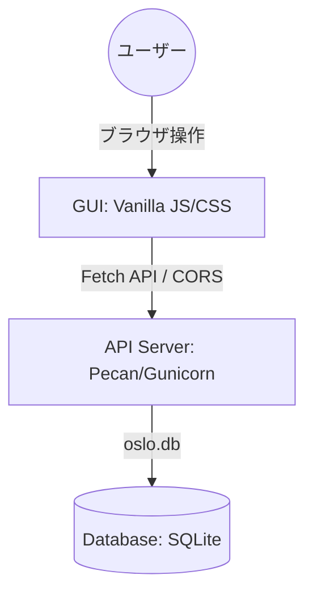
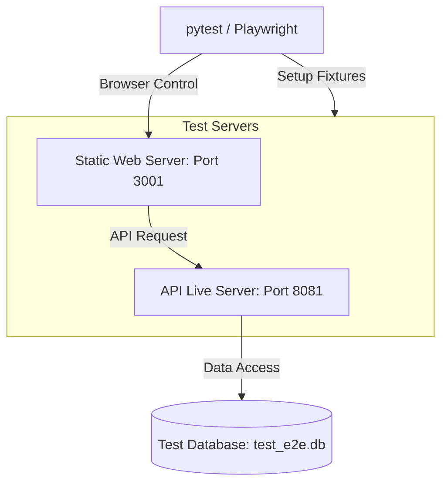

# アーキテクチャ詳細

本プロジェクトの内部構造と、各コンポーネントがどのように協調して動作するかを説明します。

## 1. システム構成と協調フロー (Coordination Flow)

### 運用時 (Production/Development)
本システムは Backend (API) と Frontend (GUI) が完全に疎結合な状態で動作します。



### 検証時 (Testing Coordination)
Playwright を使用した E2E テストでは、テストランナーが自動的に Backend と Frontend の両方を起動し、協調動作を検証します。



## 2. ソフトウェアスタック (Software Stack)

| 役割 | 技術 / ライブラリ | 備考 |
| :--- | :--- | :--- |
| **Backend API** | Python, Pecan, Gunicorn | WSGI ベースの高可用性設計 |
| **Database** | SQLite, SQLAlchemy, oslo.db | RDBMS 抽象化済み |
| **Frontend GUI** | Vanilla HTML, CSS, JavaScript | 疎結合（Fetch API + CORS） |
| **API Testing** | pytest, webtest | 高速なモックベース検証 |
| **GUI Testing** | Playwright, pytest-playwright | ブラウザ実機 E2E 検証 |

## 3. ディレクトリ構造

```text
├── etc/                   # 設定ファイル類
│   ├── apibase/
│   │   └── config.py      # アプリケーション設定 (Pecan config)
│   └── nginx/
├── build/                 # ビルド・デプロイ関連ファイル
├── bin/                   # 運用補助スクリプト (manage.sh 等)
├── public/                # 疎結合なGUIアセット (index.html, JS, CSS)
├── apibase/               # アプリケーション・パッケージ
│   ├── app.py             # WSGIエントリポイント
│   ├── api/               # Webレイヤー (Controllers)
│   ├── common/            # 共通ユーティリティ (計算ロジック等)
│   ├── db/                # DBレイヤー (Models, API)
│   └── ...
├── pyproject.toml         # プロジェクトメタデータ・設定集約
└── docker-compose.yml     # コンテナオーケストレーション
```

## 3. 認証フロー

1. クライアントが `X-Auth-Token` を付けてリクエスト。
2. `FakeAuthMiddleware` がトークンを検証（現在は模倣実装）。
3. 検証成功時、`X-User-Id` などのヘッダーを付与して後続へ渡す。
4. アプリ側は、既に認証されたものとしてヘッダーから情報を取得。

## 4. エラーハンドリング (Global Error Hook)

- 開発者は、コントローラー内で `raise exception.ItemNotFound()` のように例外を投げるだけでOK。
- `ErrorHook` が自動的に捕捉し、以下のフォーマットでクライアントに返却します。
  ```json
  {"error": {"code": 404, "message": "Item not found"}}
  ```

## 5. データベース管理

- `oslo.db` を利用し、トランザクション管理やコネクションプールを最適化しています。
- 設定ファイル (`etc/apibase/config.py`) を編集するだけで、SQLite, MySQL, PostgreSQL等へ切り替え可能です。
- **マイグレーション**: `apibase/db/migrations/` 配下の Alembic 定義を使用して、本番環境のスキーマ変更を管理します。
